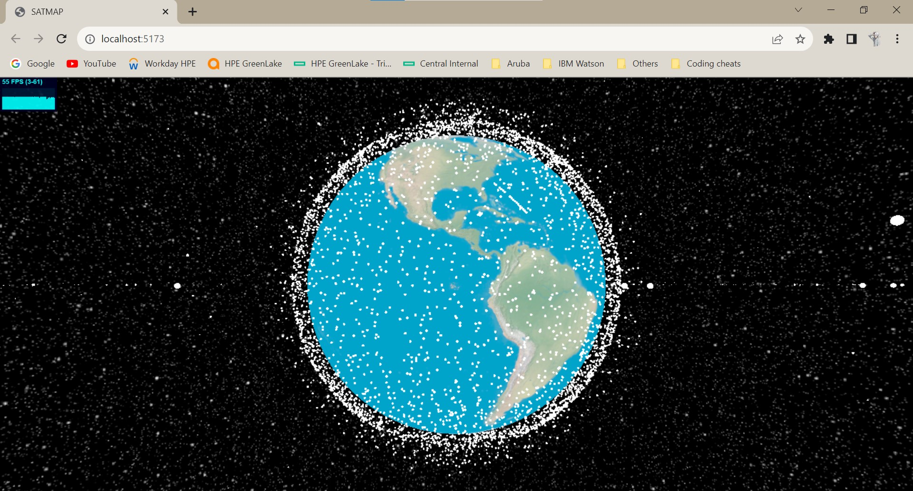
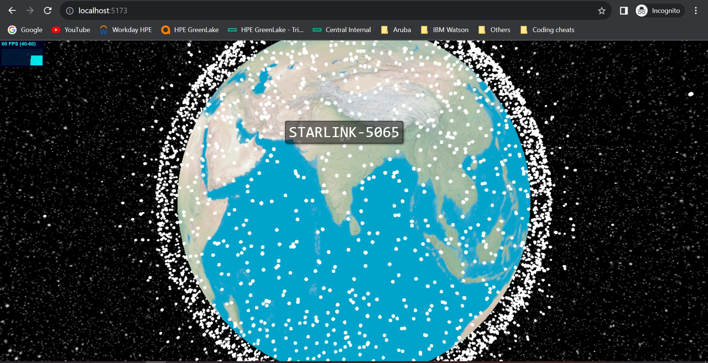

### Satellite Tracker

This Git repository contains Three.js code that renders real-time satellite positions using Two-Line Element Sets (TLEs) and the satellite.js library.
The repo optimized code that achieves a smooth 60 FPS rendering while providing tooltips displaying satellite names upon hover.

#### Setup

```bash
# fork and clone the repo
npm i
npm run dev
```

#### Links

- [Celestrak](https://celestrak.org/)
- [TLE](https://en.wikipedia.org/wiki/Two-line_element_set)
- [satellite.js](https://github.com/shashwatak/satellite-js)

#### Screenshots


